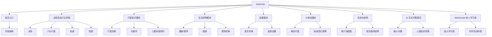

# SolarKids 产品设计说明

## 一、产品定位

SolarKids 是一款面向儿童的天体运行教学 Web 软件。它不是单纯展示天体动画，而是通过可视化轨道、点击探索、缩放视角、换肤、多语言、小游戏、AI 天文问答和多人学习房，让儿童在互动中理解太阳系运行规律。

产品关键词：

- 儿童友好
- 直观操作
- 天体运行
- 互动学习
- 轻量科普
- 前端技术展示
- AI 辅助学习
- 多人实时协作

## 二、目标用户

主要用户：

- 7-12 岁儿童
- 对太阳、月亮、行星、彗星等天体感兴趣
- 更容易被图形、动画、颜色和游戏化反馈吸引
- 不适合阅读大段说明文字

辅助用户：

- 信息技术课程教师
- 科学课教师
- 家长

## 三、用户需求分析

儿童用户的核心需求：

1. 看得懂：界面要清楚，天体和轨道要突出。
2. 点得动：按钮要大，反馈要明显。
3. 学得会：知识点要短，最好用关键词表达。
4. 玩得起：允许试错，支持拖动、切换和重置。
5. 不疲劳：动画不能闪烁太快，颜色不能过度刺眼。

## 四、信息结构设计

## 五、页面结构设计

### 1. 太阳系运行主界面

目的：

- 展示太阳、行星、轨道和运行关系。
- 作为所有交互的核心页面。

主要内容：

- Canvas 天体运行区域
- SVG 图标按钮
- 行星知识卡片
- 缩放与视角切换工具
- 皮肤、语言、小游戏入口
- AI 顾问与多人学习房入口（图标化按钮）

### 2. 行星知识卡片

目的：

- 用短句解释天体特点。
- 避免百科式长文本。

内容结构：

- 行星名称
- 代表图标或缩略图
- 3 个关键词
- 1-2 句儿童科普说明
- 关闭按钮

### 3. 设置面板

目的：

- 放置低频但重要的功能。

内容结构：

- 中文 / English
- 天体皮肤选择
- 动画速度提示
- 重置设置

### 4. 小游戏模式

目的：

- 通过拖动行星观察轨道变化，提高参与感。

内容结构：

- 拖动行星
- 轨道变化提示
- 重置按钮
- 返回主界面

### 5. AI 天文问答顾问

目的：

- 根据儿童输入的问题，快速返回太阳系、行星、银河系、宇宙、日食、磁场和彗星等知识。
- 用短句、继续探索提示和示例问题降低天文知识的理解门槛。

内容结构：

- 示例问题快捷按钮
- 问题输入框和“提问”按钮
- 知识主题、回答正文和下一步探索提示
- 离线知识卡片状态说明

### 6. WebSocket 多人学习房

目的：

- 让同一房间的同学看到彼此进入场景、探访天体等学习活动。
- 为课堂演示提供轻量的实时协作入口。

内容结构：

- 学生昵称和房间号
- 加入/离开房间按钮
- WebSocket 连接状态和在线人数
- 实时学习活动列表
- 未启动服务时的同浏览器演示回退

## 六、儿童友好设计原则

1. 操作直接：点击行星就显示知识，不让儿童先找菜单。
2. 视觉突出：太阳、行星、轨道和彗星是画面重点。
3. 文字简短：每条说明尽量控制在一两句话内。
4. 按钮清楚：常用操作使用图标加文字。
5. 允许试错：小游戏提供重置按钮。
6. 反馈及时：点击、拖动、切换后立刻出现变化。
7. 动画温和：速度平滑，避免强闪烁和高频跳动。
8. 首次进入可控：欢迎页等待素材和 Canvas 初始化完成，点击开始后才启动主动画。
9. AI 回答可解释：优先使用可核对的儿童知识卡片，未知问题明确提示范围，不伪装成实时搜索。
10. 协作状态透明：WebSocket 连接、在线人数和本地演示回退状态都在弹窗中明确显示。

## 七、设计决策说明

1. 采用 Canvas 作为核心动画区域，因为天体运行需要连续绘制和稳定动画。
2. 采用 SVG 绘制按钮图标和部分天体素材，因为 SVG 清晰、可缩放、适合响应式界面。
3. 不把知识内容直接铺满屏幕，而是放入行星卡片，减少儿童阅读压力。
4. 将主流程控制在 5 步以内，符合儿童注意力和操作习惯。
5. 使用 LocalStorage 保存语言、皮肤等设置，让儿童下次打开时有连续体验。
6. 使用 JSON 管理行星数据和多语言文本，方便团队分工和后期维护。
7. AI 顾问采用前端可解释的关键词匹配知识卡片，避免把密钥放入浏览器，也保证离线课堂可用。
8. 多人学习采用独立 WebSocket 客户端和无依赖 Node 服务端；服务不可用时回退 BroadcastChannel，不阻断单人学习。

