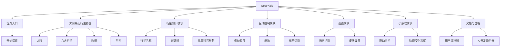

# SolarKids 产品设计说明

## 一、产品定位

SolarKids 是一款面向儿童的天体运行教学 Web 软件。它不是单纯展示天体动画，而是通过可视化轨道、点击探索、缩放视角、换肤、多语言和小游戏，让儿童在互动中理解太阳系运行规律。

产品关键词：

- 儿童友好
- 直观操作
- 天体运行
- 互动学习
- 轻量科普
- 前端技术展示

## 二、目标用户

主要用户：

- 7-12 岁儿童
- 对太阳、月亮、行星、彗星等天体感兴趣
- 更容易被图形、动画、颜色和游戏化反馈吸引
- 不适合阅读大段说明文字

辅助用户：

- 信息技术课程教师
- 科学课教师
- 家长
- 项目答辩评委

## 三、用户需求分析

儿童用户的核心需求：

1. 看得懂：界面要清楚，天体和轨道要突出。
2. 点得动：按钮要大，反馈要明显。
3. 学得会：知识点要短，最好用关键词表达。
4. 玩得起：允许试错，支持拖动、切换和重置。
5. 不疲劳：动画不能闪烁太快，颜色不能过度刺眼。

教师和评委的核心需求：

1. 能体现课程技术要求。
2. 能展示完整的产品设计思考。
3. 有清楚的 Git 版本管理记录。
4. 有用户流程图和 AI 协同开发说明。
5. 功能完整，运行稳定，适合答辩演示。

## 四、信息结构设计

## 五、页面结构设计

### 1. 首页

目的：

- 快速建立儿童对主题的兴趣。
- 提供清晰入口，不做复杂介绍。

主要内容：

- 项目名称：SolarKids
- 主按钮：开始探索
- 辅助入口：语言切换、简单说明

### 2. 太阳系运行主界面

目的：

- 展示太阳、行星、轨道和运行关系。
- 作为所有交互的核心页面。

主要内容：

- Canvas 天体运行区域
- SVG 图标按钮
- 行星知识卡片
- 缩放与视角切换工具
- 皮肤、语言、小游戏入口

### 3. 行星知识卡片

目的：

- 用短句解释天体特点。
- 避免百科式长文本。

内容结构：

- 行星名称
- 代表图标或缩略图
- 3 个关键词
- 1-2 句儿童科普说明
- 关闭按钮

### 4. 设置面板

目的：

- 放置低频但重要的功能。

内容结构：

- 中文 / English
- 天体皮肤选择
- 动画速度提示
- 重置设置

### 5. 小游戏模式

目的：

- 通过拖动行星观察轨道变化，提高参与感。

内容结构：

- 拖动行星
- 轨道变化提示
- 重置按钮
- 返回主界面

## 六、儿童友好设计原则

1. 操作直接：点击行星就显示知识，不让儿童先找菜单。
2. 视觉突出：太阳、行星、轨道和彗星是画面重点。
3. 文字简短：每条说明尽量控制在一两句话内。
4. 按钮清楚：常用操作使用图标加文字。
5. 允许试错：小游戏提供重置按钮。
6. 反馈及时：点击、拖动、切换后立刻出现变化。
7. 动画温和：速度平滑，避免强闪烁和高频跳动。

## 七、功能优先级

### 必须完成

- 太阳系运行动画
- 行星点击知识卡片
- 播放 / 暂停
- 缩放
- 视角切换
- 响应式布局
- JSON 数据读取
- LocalStorage 设置保存
- 用户操作流程图
- AI 协同开发说明书

### 优先加分

- 彗星多条轨道模拟
- 动态彗尾效果
- 天体换肤
- 中英文多语言

### 时间充足再做

- 太阳风与地球磁场互动
- 拖动行星观察引力和轨道变化小游戏

## 八、设计决策说明

1. 采用 Canvas 作为核心动画区域，因为天体运行需要连续绘制和稳定动画。
2. 采用 SVG 绘制按钮图标和部分天体素材，因为 SVG 清晰、可缩放、适合响应式界面。
3. 不把知识内容直接铺满屏幕，而是放入行星卡片，减少儿童阅读压力。
4. 将主流程控制在 5 步以内，符合儿童注意力和操作习惯。
5. 使用 LocalStorage 保存语言、皮肤等设置，让儿童下次打开时有连续体验。
6. 使用 JSON 管理行星数据和多语言文本，方便团队分工和后期维护。

## 九、答辩展示重点

答辩时可以按以下顺序展示：

1. 展示 GitHub 仓库和分支，说明四人协作方式。
2. 展示用户操作流程图，说明核心功能不超过 5 步。
3. 展示太阳系运行主界面。
4. 点击行星，展示儿童科普知识卡片。
5. 展示缩放、视角切换和皮肤功能。
6. 展示加分项，例如彗星轨道、多语言或小游戏。
7. 展示 AI 开发说明书，说明 AI 生成内容和学生修改判断。

