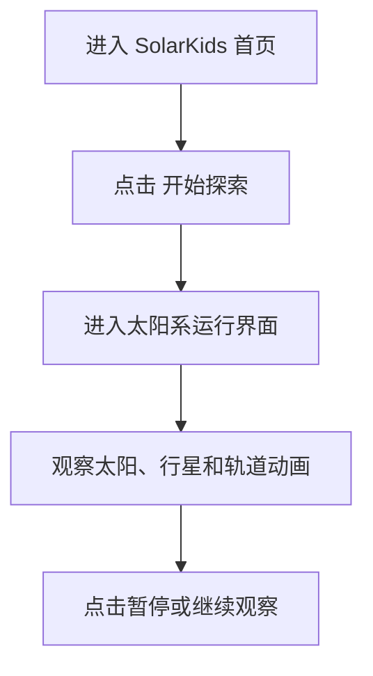
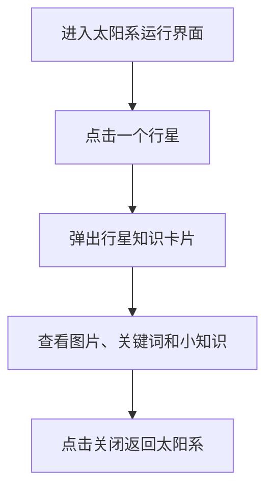
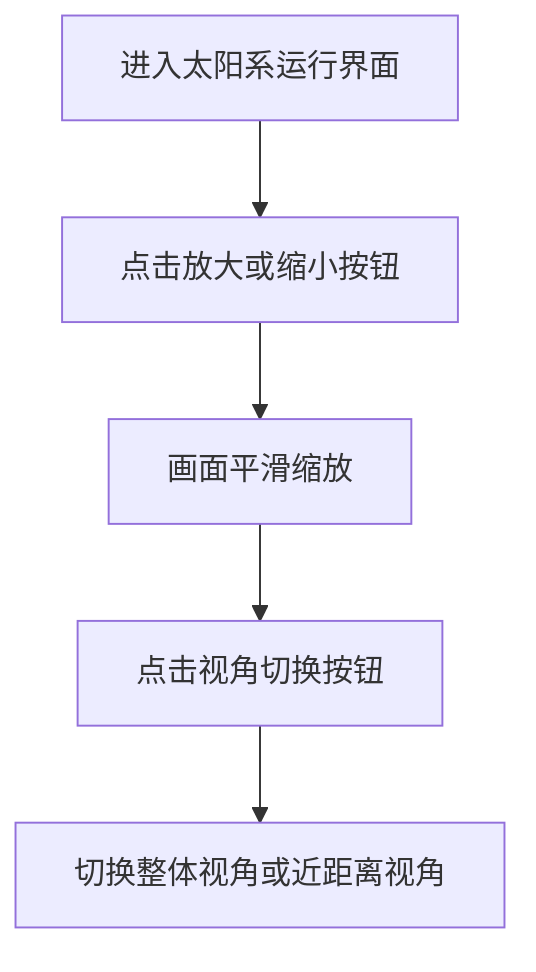
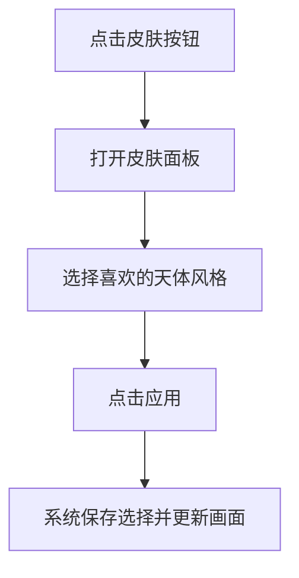
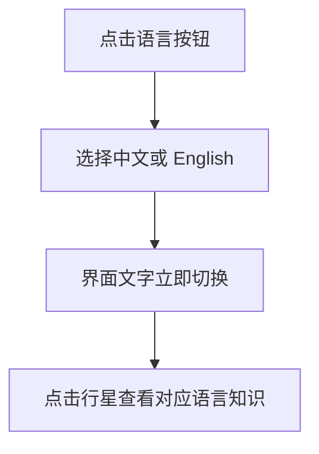
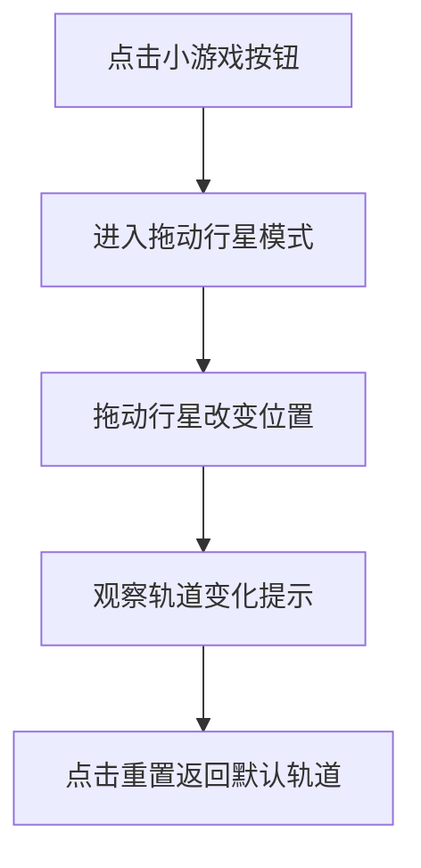
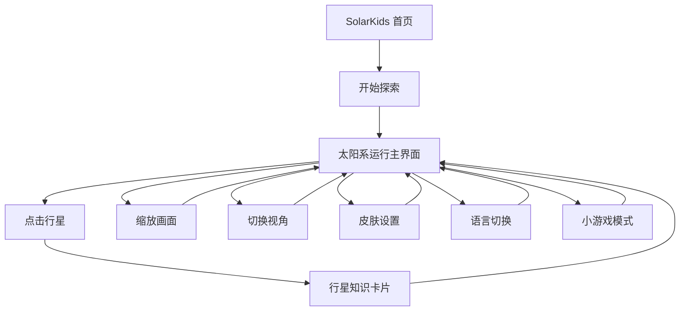

# SolarKids 用户操作流程图

## 一、设计目标

本流程图面向 7-12 岁儿童用户，目标是让孩子可以在 5 步以内完成核心学习任务。流程遵循“先看见、再点击、再探索、再反馈”的认知顺序，减少复杂菜单和文字说明，让主要操作都能通过明显按钮、图标和动画反馈完成。

## 二、核心用户路径

### 路径1：观察太阳系运行

操作步数：4 步。

儿童理解逻辑：

- 先看到太阳系整体画面。
- 再通过“开始探索”进入主体验。
- 通过动画理解行星围绕太阳运行。
- 可随时暂停，避免信息过快。

### 路径2：查看某个行星知识

操作步数：4 步。

儿童理解逻辑：

- 直接点击感兴趣的行星。
- 不要求先理解复杂菜单。
- 知识卡片使用短句、关键词和图形。
- 关闭后回到原来的探索场景。

### 路径3：缩放和切换视角

操作步数：4 步。

儿童理解逻辑：

- 放大、缩小使用常见图标。
- 视角切换不做复杂参数设置。
- 缩放过程使用平滑动画，减少眩晕。

### 路径4：更换天体皮肤

操作步数：4 步。

儿童理解逻辑：

- 使用颜色和缩略图帮助选择。
- 皮肤变化立即反馈。
- 选择结果保存到 LocalStorage，下次打开仍然生效。

### 路径5：切换中英文科普

操作步数：3 步。

儿童理解逻辑：

- 语言入口放在固定位置。
- 切换后立刻看到变化。
- 英文使用儿童科普短句，避免长段落。

### 路径6：拖动行星小游戏

操作步数：4 步。

儿童理解逻辑：

- 用“拖一拖、看变化”的方式理解轨道。
- 不要求输入数值或公式。
- 重置按钮保证孩子可以放心尝试。

## 三、主界面流程总图

## 四、关键交互原则

1. 核心功能入口始终可见，避免儿童在多层菜单中迷路。
2. 所有主要功能控制在 5 步以内完成。
3. 按钮使用图标加简短文字，例如“开始”“暂停”“放大”“返回”。
4. 重要反馈使用动画、颜色变化和提示语共同表达。
5. 出错或无效操作时不使用严厉提示，改用鼓励性语言，例如“再试一次看看轨道怎么变”。
6. 保留“返回”和“重置”按钮，让儿童可以放心探索。

