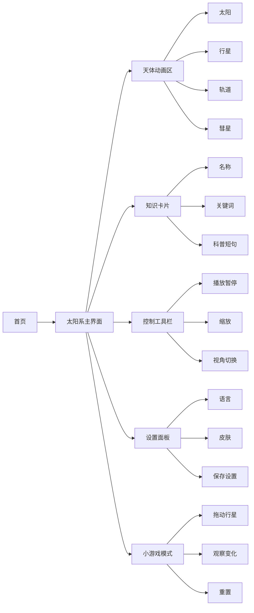

# SolarKids 页面信息架构与交互说明

## 一、信息架构

SolarKids 的信息结构按照儿童认知顺序组织：

```text
先进入 -> 看整体 -> 点天体 -> 学知识 -> 调视角 -> 玩互动 -> 保存设置
```

整体信息架构：



## 二、主界面布局建议

PC 端：

- 中央：Canvas 太阳系动画区。
- 左侧或底部：主要控制按钮。
- 右侧：行星知识卡片或设置面板。
- 顶部：项目名称、语言切换、皮肤入口。

iPad 端：

- 上方：项目名称和常用设置。
- 中央：Canvas 动画区。
- 底部：控制按钮。
- 知识卡片以浮层出现。

手机端：

- 顶部：简短标题和设置入口。
- 中央：动画区。
- 底部：大按钮工具栏。
- 知识卡片使用底部弹出层，避免遮挡主要天体。

## 三、儿童直观操作设计

### 点击行星

行为：

- 儿童点击某颗行星。

反馈：

- 行星轻微放大或高亮。
- 弹出知识卡片。
- 轨道仍保持低速运行或自动暂停。

原因：

- 儿童能明确知道自己点中了什么。

### 播放 / 暂停

行为：

- 点击播放或暂停按钮。

反馈：

- 动画开始或停止。
- 按钮图标同步变化。

原因：

- 方便儿童慢慢观察行星位置。

### 缩放

行为：

- 点击放大或缩小按钮。

反馈：

- 画面平滑缩放。
- 不突然跳转。

原因：

- 保护视觉体验，减少眩晕。

### 视角切换

行为：

- 点击视角按钮。

反馈：

- 在“整体太阳系”和“近距离观察”之间切换。

原因：

- 让儿童既能理解整体关系，也能观察单个天体。

### 皮肤更换

行为：

- 打开皮肤面板，选择皮肤。

反馈：

- 天体外观立即变化。
- 设置保存到 LocalStorage。

原因：

- 增加趣味性和个性化。

### 多语言切换

行为：

- 选择中文或 English。

反馈：

- 按钮、提示语、知识卡片同步切换。

原因：

- 满足儿童科普英语学习场景。

## 四、核心任务步数检查

| 任务 | 操作步骤 | 是否 <= 5 步 |
| --- | --- | --- |
| 观察太阳系运行 | 进入首页 -> 开始探索 -> 观察动画 -> 暂停/继续 | 是 |
| 查看行星知识 | 进入主界面 -> 点击行星 -> 查看卡片 -> 关闭 | 是 |
| 缩放观察 | 进入主界面 -> 点击放大/缩小 -> 观察变化 | 是 |
| 切换视角 | 进入主界面 -> 点击视角按钮 -> 观察变化 | 是 |
| 更换皮肤 | 点击皮肤 -> 选择皮肤 -> 应用 -> 保存 | 是 |
| 切换语言 | 点击语言 -> 选择语言 -> 查看变化 | 是 |
| 小游戏体验 | 点击小游戏 -> 拖动行星 -> 观察变化 -> 重置 | 是 |

## 五、提示语设计

提示语要短、亲切、鼓励探索：

- “点一点行星，看看它的小秘密。”
- “拖动行星，观察轨道怎么变化。”
- “放大一点，看得更清楚。”
- “想回到原来的样子？点重置。”
- “太棒了，你发现了新的轨道变化！”

避免使用：

- “操作错误”
- “参数无效”
- “系统异常”
- 过长的百科说明

## 六、与评分标准对应

| 评分点 | 对应设计 |
| --- | --- |
| 产品设计能力 | 用户分析、信息架构、页面流程、功能优先级 |
| 儿童友好体验 | 大按钮、短提示、5 步以内、允许试错 |
| UI 视觉设计 | 明亮色彩、重点天体突出、响应式布局 |
| SVG/Canvas 技术 | Canvas 负责动画，SVG 负责图标和视觉素材 |
| 功能完整性 | 天体运行、知识展示、缩放视角、换肤、多语言 |
| AI 协同开发说明 | 记录 AI 生成、学生修改和设计决策 |

